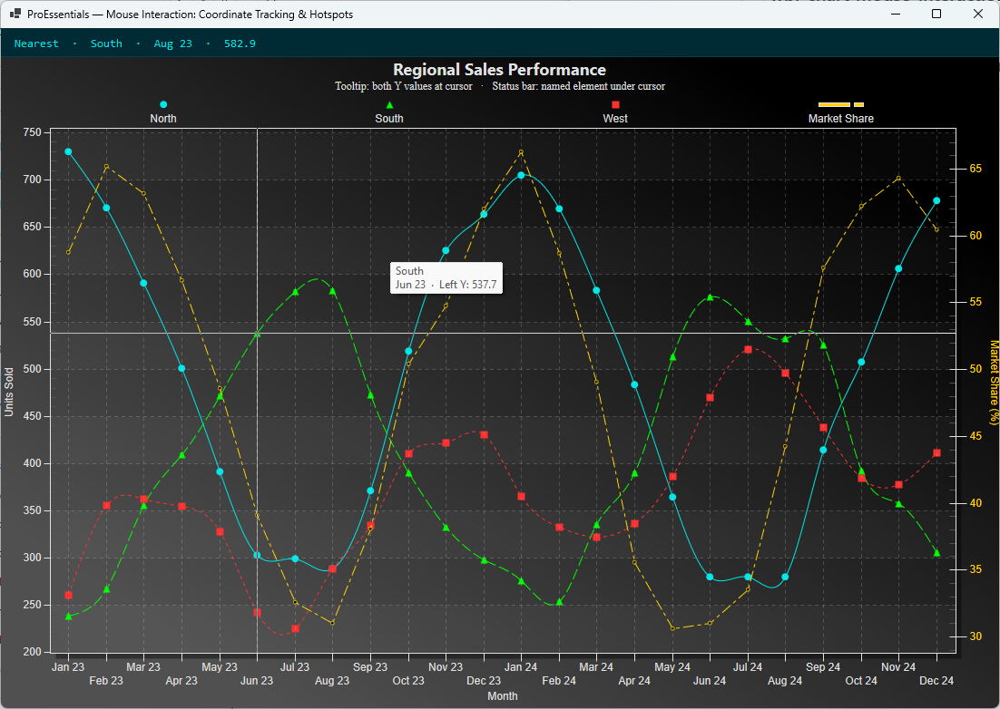

# Mouse Interaction: Coordinate Tracking & Hotspots — WinForms

ProEssentials v10 **WinForms .NET 8** — a dual-Y-axis `Pego` chart that combines
**two complementary mouse-interaction techniques**: a `ConvPixelToGraph` tooltip
showing both Y-axis values at the cursor, and a `GetHotSpot` status bar that
names the chart element under the cursor (data point, series legend, or point
label). Direct2D.

---

## What This Demonstrates

- **Technique 1 — `ConvPixelToGraph` tooltip** (Example 007): the
  `PeCustomTrackingDataText` event converts the mouse pixel position to graph
  coordinates, called twice (left Y and right Y) to show both axis values at
  the cursor, interpolated continuously between data points.
- **Technique 2 — `GetHotSpot` status bar** (Example 014): `MouseMove` calls
  `GetHotSpot()` to identify the named element under the cursor; when not over a
  named element, `SearchSubsetPointIndex` reports the nearest data point.
- **Dual Y axis** via `RYAxisComparisonSubsets = 1` — three regional sales
  series on the left Y, market-share percentage on the right Y.
- **Code-built UI** — the form (status bar + chart) is constructed entirely in
  C#; no `.Designer.cs`, no `.resx`, so the WinForms designer is never invoked.

---

## WinForms vs WPF

This is the WinForms sibling of the WPF Mouse Interaction example. The
ProEssentials chart configuration is **identical** between the two. The only
differences are the host shell (WinForms `Panel` status bar + docked chart vs
WPF `Grid`) and the geometry types in the mouse handlers: WPF's
`System.Windows.Point` / `Rect` become `System.Drawing.Point` / `Rectangle` on
the WinForms control (integer coordinates, no casts needed). `GetHotSpot`,
`ConvPixelToGraph`, and `SearchSubsetPointIndex` are chart-object members and
are unchanged.

➡️ WPF version: [wpf-chart-mouse-interaction-hotspots-coordinate-tracking-proessentials](https://github.com/GigasoftInc/wpf-chart-mouse-interaction-hotspots-coordinate-tracking-proessentials)

---

## Prerequisites

- Visual Studio 2022
- .NET 8 SDK (Windows)
- Internet connection for NuGet restore
- x64

---

## How to Run

1. Clone this repository
2. Open `MouseInteractionHotspots.sln` in Visual Studio 2022
3. Build → Rebuild Solution (restores the NuGet package automatically)
4. Press F5
5. Move the mouse over the chart — watch the tooltip show both Y values and the
   status bar name the element under the cursor. Left-drag to zoom; right-click
   for the context menu.

> **Designer note:** This project has no `.Designer.cs` by design — the UI is
> built in code in `MainForm.cs`, avoiding native-control designer issues.

---

## NuGet Package

References [`ProEssentials.Chart.Net80.x64.Winforms`](https://www.nuget.org/packages/ProEssentials.Chart.Net80.x64.Winforms)
from nuget.org. Package restore happens automatically on build.

---

## License

Example code is MIT licensed. ProEssentials requires a commercial license for
continued use.
